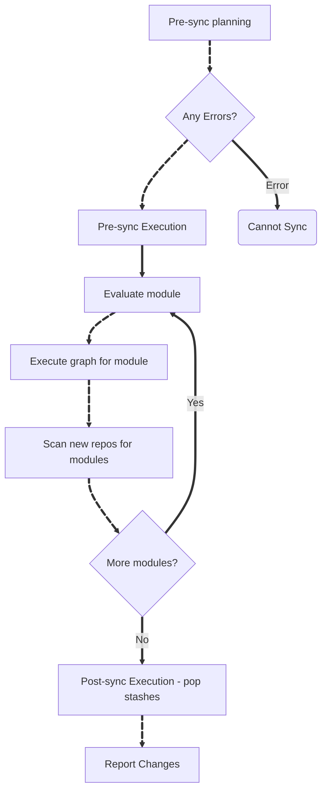

`spaces checkout-repo` (and `spaces co`) sets up the initial repository graph for a workspace. `spaces sync` then re-evaluates checkout rules and updates repositories, including configurable handling for development branches (**dev-branch**).

## Checkout: Create a New Workspace

`spaces checkout-repo` clones the root repo and evaluates top-level `[*.]spaces.star` files, which can add more repos to the workspace.

`spaces co` is a shortcut that loads checkout settings from `co.spaces.toml`. This allows for easily re-created complex workspaces.

### Creating Development Branches

When you pass `--new-branch=<path to repo>`, `spaces` creates a local branch for that repo and treats it as a **dev-branch** in later sync operations.

```sh
spaces checkout-repo \
  --name=fix-parser-bug \
  --url=https://github.com/work-spaces/spaces \
  --rev=main \
  --new-branch=spaces
```

In this example:

- `spaces` is checked out from `main`.
- A local branch named `fix-parser-bug` is created for the `spaces` repo.
- That repo is now tracked as a **dev-branch** for sync planning.

## Syncing the Workspace with Upstream Changes

For a monorepo, developers use `git pull` with rebase or merge to synchronize to upstream changes. With `spaces`, a `git pull` can affect the checkout rules causing the state of the workspace go go stale. Additionally, the workspace may have multiple repos that all need to be pulled.

`spaces sync` is used in place of `git pull`. `spaces sync` will rebase/merge **dev-branches** in the workspace, re-run the checkout rules, and report the changes.

| Case | Default sync behavior |
|---|---|
| Non-dev repo pinned to a branch | Updates to the latest commit on that branch. |
| Non-dev repo pinned to a tag/commit | Moves to that exact revision. |
| Dev-branch repo | Rebases by default (unless overridden). |

During sync, a repo's target revision can change based on rules (for example, branch -> tag, or tag/commit -> branch).

### Dev-branch strategy controls

By default, dev branches are rebased. You can override this per repo or globally:

- `--merge=<repo-path>`: merge instead of rebase.
- `--no-rebase-repo=<repo-path>`: skip both rebase and merge for that repo.
- `--no-rebase`: skip rebase for all dev-branch repos (unless explicitly listed in `--merge`).


Dev-branch rebases/merges require a valid base reference. If a repo is on a local dev branch but the configured `rev` is a tag/commit (not a branch), pass `--dev-branch-base=<repo-path>=<ref>` so sync knows what to rebase or merge against.


## Sync lifecycle

{}

### Pre-Sync Verification

`spaces` collects status for all repos and validates the planned operations.

Validation includes:
- Can **dev-branches** be rebased/merged without conflicts?
- Are all repos clean?
- Are local branches associated with upstream branches?

Change the default behavior of `sync` with:

- Use `--dry-run` to just run the pre-sync checks. 
- Use `--allow-dirty` to skip pre-sync checks evaluate the starlark rules.
- Use `--dev-branch=<path to repo>` to mark a repository as a **dev-branch**
  - Use `--dev-branch-base=<path to repo>=origin/<target remote branch>` to specify a target remote branch that is different from the `rev` set in the rules.
  - Use `--no-rebase` to skip rebasing of all **dev-branches**
  - Use `--no-repase-repo=<path to repo>` to skip rebasing a specific repo.
  - Use `--merge=<path to repo>` to merge instead of rebase.
- Use `--new-brnach=<path to repo>` to mark a repository as a **dev-branch** and create a new branch using the workspace name
- Use `--stash` to stash changes on dirty repos during pre-sync execution and pop the changes during post-sync execution.



If your stashed changes include edits to checkout rules, those edits are **not** part of the sync execution. Sync is executed while the changes are stashed.


### Pre-Sync Execution

- Stash changes to dirty repos (if `--stash` specified).
- Rebase/merge **dev-branches** to the upstream target branches

### Sync: Evaluate and Execute Checkout Rules

Sync re-evaluates `spaces` modules file-by-file:

1. Evaluate one module and build/refresh its graph.
2. Execute that graph.
3. Scan any newly checked-out repos for more modules.
4. Repeat for the next module.

### Post-Sync Execution

`spaces` re-collects repo status and pops stashes (if `--stash`).

### Post-Sync Reporting

`spaces` prints a report of how all the repos changed in the workspace.


{}

## Sync Flow Chart



## Practical command patterns

```sh
# Plan only (no repo changes)
spaces sync --dry-run

# Standard sync with auto-stash for dirty working trees
spaces sync --stash

# Dev branch: merge one repo, skip rebase for another
spaces sync \
  --merge=my-lib \
  --no-rebase-repo=my-app

# Dev branch created from a non-branch rev: provide explicit base
spaces sync --dev-branch=my-lib --dev-branch-base=my-lib=origin/main
```

## Summary

- Use [`spaces co`](/docs/guides/using-co/) to make checkout setups repeatable.
- For day-to-day branch workflows, continue with [Rebasing, Merging, and Syncing](/docs/guides/rebasing-merging-syncing/).
- Check live options with:

```sh
spaces co --help
spaces checkout-repo --help
spaces sync --help
```
