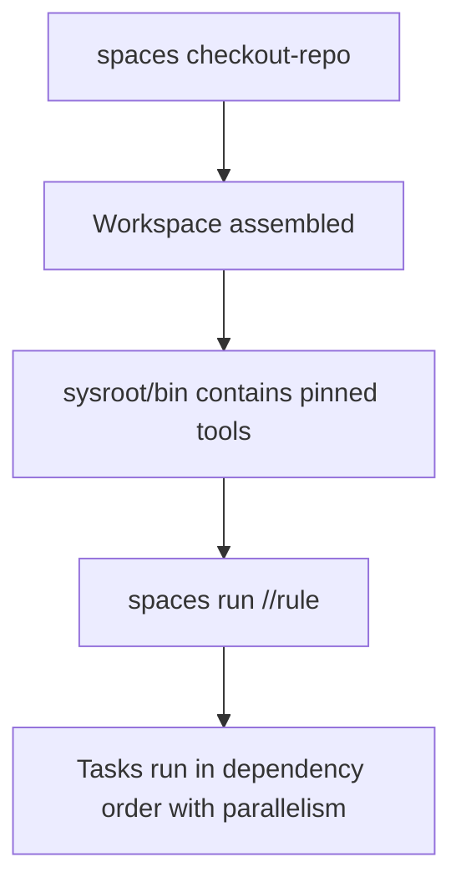

Most teams eventually hit the same setup problem: **how do we guarantee every contributor and every CI job uses the same tools and versions?**


Without a shared, reproducible workspace model, onboarding slows down, CI drifts from local environments, and version mismatches create hard-to-reproduce bugs.


## Common approaches (and their trade-offs)

### Docker / Dev Containers

Containers improve reproducibility, but they come with practical friction:

- **Heavy abstraction:** full Linux userspace, even on macOS/Windows.
- **Slower file I/O on macOS:** bind mounts can be a bottleneck.
- **IDE friction:** often requires remote/container-specific editor setup.
- **Limited composability:** combining tools from multiple images usually means building a custom image.
- **Linux-centric runtime:** not ideal when you must build/test natively on macOS or Windows.

### Monorepos (Bazel/Buck/etc.)

Monorepos can be powerful, but they impose ecosystem-wide constraints:

- **All-or-nothing adoption:** projects must align to one build system and conventions.
- **Scaling overhead:** large repos need specialized tooling for checkout/indexing/CI.
- **Steep learning curve:** advanced build graph concepts, toolchains, and remote execution.

### Nix / Guix

Functional package managers are reproducible, but often hard to operationalize:

- **Steep learning curve:** language and ecosystem complexity.
- **Large local store:** many dependency variants consume significant disk.
- **Opaque behavior:** debugging derivations requires deep internals knowledge.
- **Linux-first experience:** macOS support exists, but often feels second-class.

### System Package Managers

`apt`, `brew`, and `choco` are convenient, but weak for per-project reproducibility:

- **Global mutable state:** installs affect every project on the machine.
- **Version conflicts:** two projects needing different tool versions collide.
- **Weak pinning guarantees:** `brew install cmake` gives current, not necessarily required, versions.

### Language-specific Dependency Tools

Tools like Cargo/CMake/npm solve dependency management inside one ecosystem:

- **Single-language scope:** they do not manage the full developer toolchain.
- **No workspace model:** they handle build deps, not the complete multi-repo/multi-tool environment.

## How `spaces` is different

`spaces` is a lightweight workspace manager delivered as a single statically linked binary.

| Capability | How `spaces` does it |
|---|---|
| **Reproducible tools** | Binary archives are downloaded by SHA256 hash and hard-linked from a content-addressed store into your workspace `sysroot`. |
| **Multi-repo checkout** | Assemble one workspace from multiple git repositories, each pinned to a revision. |
| **Cross-platform** | Works natively on macOS (`x86_64`, `aarch64`), Linux (`x86_64`), and Windows (`x86_64`). |
| **Task execution** | Runs builds/tests/checks through a dependency graph with parallel execution. |
| **Composable** | Starlark rules are plain functions. Packages like `rust_add()` and `cmake_add()` hide complex setup behind simple calls. |
| **Efficient storage** | Artifacts are SHA256-addressed and stored once in `~/.spaces/store`; multiple workspaces share binaries via hard links. |
| **IDE integration** | Checkout rules can generate `.vscode/settings.json`, `.zed/settings.json`, and related config for immediate editor readiness. |


`spaces` aims to keep environments **reproducible like containers**, while remaining **native, composable, and fast** on your host OS.


## How it works

`spaces` executes Starlark workflows in two phases:

1. **Checkout**: assemble repositories, tools, archives, and config.
2. **Run**: execute tasks via a dependency graph.



{}

### Checkout a workspace

```sh
spaces checkout-repo \
  --url=<git-repo-url> \
  --name=<workspace-folder-name> \
  --rev=main
```

### Enter the workspace

```sh
cd <workspace-folder-name>
```

### Run tasks

```sh
spaces run
```

{}

### Concrete example: build `spaces` from source

```sh
spaces checkout-repo \
  --url=https://github.com/work-spaces/spaces \
  --rev=main \
  --new-branch=spaces \
  --name=issue-x-fix-something
cd issue-x-fix-something
spaces run //spaces:check
```


The checkout step creates a self-contained workspace directory. Inside it, `sysroot/bin` contains the exact tool versions your project needs, isolated from both your system-wide environment and other workspaces.

