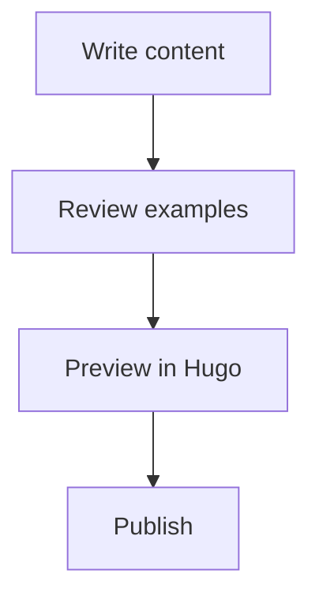

# Skill: Create Hextra (Hugo) Documentation Pages

Use this skill when asked to create or revise a documentation page for a Hugo site that uses the Hextra theme.

## Goal

Produce a clean, publishable Markdown page that:

1. Uses standard Hugo front matter.
2. Uses Hextra-native markup and shortcodes.
3. Is easy to scan (headings, short sections, examples).
4. Prefers practical examples over abstract explanation.

## Required Output Shape

Return **only** the page Markdown content unless the user asks for extra explanation.

Start with front matter:

```yaml
---
title: <Page Title>
description: <1 sentence summary>
toc: true
weight: <number-if-provided>
---
```

Then include:

- A short intro paragraph.
- Clear `##`/`###` sections.
- At least one concrete example.
- Actionable next steps or references when relevant.

## Hextra Feature Selection Rules

When generating documentation pages, prefer these Hextra features:

1. **Callouts** for key notes, warnings, prerequisites.
2. **Steps** for procedural tasks.
3. **Tabs** for multi-language or multi-tool variants.
4. **Details** for optional/advanced context.
5. **FileTree** for folder/file structure explanation.
6. **Diagrams (Mermaid)** for process/architecture flows.
7. **LaTeX** for formulas/math-heavy docs.
8. **Syntax Highlighting** for all code snippets.
9. **Icons / Badges / Others** where they improve scanning (not decoration-only).

Do not force every feature into every page; use what improves clarity.

## Canonical Hextra Markup Snippets

### 1) Callout

```md

Default callout content.



Helpful context for the reader.



Important caution.



What can fail and how to recover.



Critical takeaway.

```

### 2) Details

```md

Expanded explanation with **Markdown** support.



Hidden by default.

```

### 3) FileTree

```md

  
    
    
      
      
    
  
  

```

### 4) Tabs

Do not use.

### 5) Steps

Use `steps` for procedural docs. Keep step content as Markdown.

```md
{}

### Install dependencies

Run the install command for your platform.

### Configure project

Create and update the config file.

#### Optional background {class="no-step-marker"}

This heading will not increment the step counter.

### Verify setup

Run the health check command.

{}
```

### 6) Diagrams (Mermaid)

````md

````

### 7) LaTeX

Inline math:

```md
Use \(\sigma(z)=\frac{1}{1+e^{-z}}\) for sigmoid.
```

Display math:

```md
$$
F(\omega)=\int_{-\infty}^{\infty} f(t)e^{-j\omega t}\,dt
$$
```

### 8) Syntax Highlighting

Use fenced code blocks with language and optional attributes:

````md
```python {filename="hello.py",linenos=table,hl_lines=[2]}
def say_hello():
    print("Hello")
```
````

### 9) Icons and Misc

Icon shortcode:

```md

```

Badge shortcode:

```md

```

YouTube shortcode:

```md

```

PDF shortcode:

```md

```

## Authoring Guidance

- Prefer short paragraphs and meaningful section names.
- Include runnable commands and realistic paths.
- For comparisons, use tabs.
- For warnings/prerequisites, use callouts.
- For hidden detail, use details.
- For multi-step flow, use steps.
- For architecture/process, use mermaid.
- For formulas, use LaTeX only when needed.
- Keep code blocks focused and syntax-highlighted.

## Validation Checklist (Before Returning)

- Front matter exists and is valid YAML.
- Shortcodes are correctly opened/closed.
- Headings follow a logical hierarchy.
- Code fences include language identifiers.
- No placeholder text like `<TODO>` remains.
- Content is ready to drop into `content/docs/.../*.md`.

## Reference URLs

- Callout: https://imfing.github.io/hextra/docs/guide/shortcodes/callout/
- Details: https://imfing.github.io/hextra/docs/guide/shortcodes/details/
- FileTree: https://imfing.github.io/hextra/docs/guide/shortcodes/filetree/
- Icon: https://imfing.github.io/hextra/docs/guide/shortcodes/icon/
- Misc (Badge/YouTube/PDF): https://imfing.github.io/hextra/docs/guide/shortcodes/others/
- Steps: https://imfing.github.io/hextra/docs/guide/shortcodes/steps/
- Tabs: https://imfing.github.io/hextra/docs/guide/shortcodes/tabs/
- Diagrams: https://imfing.github.io/hextra/docs/guide/diagrams/
- LaTeX: https://imfing.github.io/hextra/docs/guide/latex/
- Code Highlighting: https://imfing.github.io/hextra/docs/guide/syntax-highlighting/
